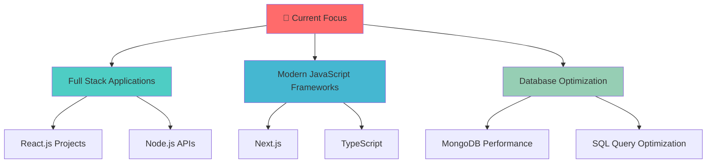

# 🚀 Welcome to My Digital Universe!

<div align="center">
  
<!-- Animated Typing Header -->
[](https://git.io/typing-svg)


<!-- Animated Wave -->


</div>

---

## 🎯 About Me

<div align="center">
  


</div>

```javascript
const chiranth = {
    role: "Full Stack Developer",
    passion: ["Web Development", "Problem Solving", "Innovation"],
    currentFocus: "Building scalable web applications",
    lifeGoal: "Create impactful solutions for real-world problems",
    funFact: "I debug with console.log and I'm proud of it! 😄"
};

console.log("Welcome to my GitHub profile! 🚀");
```

<br clear="right"/>

---

## 🛠️ Tech Arsenal

<div align="center">

### 🎨 Frontend Technologies
<table>
<tr>
    <td align="center" width="96">
        
        <br><strong>HTML5</strong>
    </td>
    <td align="center" width="96">
        
        <br><strong>CSS3</strong>
    </td>
    <td align="center" width="96">
        
        <br><strong>JavaScript</strong>
    </td>
    <td align="center" width="96">
        
        <br><strong>React</strong>
    </td>
    <td align="center" width="96">
        
        <br><strong>Bootstrap</strong>
    </td>
    <td align="center" width="96">
        
        <br><strong>Tailwind</strong>
    </td>
</tr>
</table>

### ⚙️ Backend & Server Technologies
<table>
<tr>
    <td align="center" width="96">
        
        <br><strong>Node.js</strong>
    </td>
    <td align="center" width="96">
        
        <br><strong>Express</strong>
    </td>
    <td align="center" width="96">
        
        <br><strong>Java</strong>
    </td>
    <td align="center" width="96">
        
        <br><strong>Python</strong>
    </td>
</tr>
</table>

### 🗄️ Database Technologies
<table>
<tr>
    <td align="center" width="96">
        
        <br><strong>MongoDB</strong>
    </td>
    <td align="center" width="96">
        
        <br><strong>MySQL</strong>
    </td>
    <td align="center" width="96">
        
        <br><strong>PostgreSQL</strong>
    </td>
</tr>
</table>

### 🔧 Development Tools
<table>
<tr>
    <td align="center" width="96">
        
        <br><strong>Git</strong>
    </td>
    <td align="center" width="96">
        
        <br><strong>GitHub</strong>
    </td>
    <td align="center" width="96">
        
        <br><strong>VS Code</strong>
    </td>
    <td align="center" width="96">
        
        <br><strong>Postman</strong>
    </td>
</tr>
</table>

</div>

---

## 📊 GitHub Analytics

<div align="center">
  
<!-- Animated Stats Cards -->


<!-- Contribution Graph -->


<!-- GitHub Streak -->


</div>

---

## 🏆 GitHub Trophies

<div align="center">
  
[](https://github.com/ryo-ma/github-profile-trophy)

</div>

---

## 🎨 Current Projects & Learning

<div align="center">



</div>

---

## 🌐 Let's Connect & Collaborate!

<div align="center">
  
<!-- Animated Connect Section -->


<h3>💬 Feel free to reach out for collaborations or just a friendly chat!</h3>

<p align="center">
  <a href="mailto:Chiranthmoger7@gmail.com">
    
  </a>
  <a href="https://www.linkedin.com/in/chiranthmoger-01a867316">
    
  </a>
  <a href="https://github.com/Chiranth-Janardhan-moger">
    
  </a>
</p>

<!-- Animated Divider -->


<!-- Quote -->
<div align="center">
  
### 💭 Developer Quote
  
[](https://github.com/piyushsuthar/github-readme-quotes)

</div>

</div>

---

## 🐍 Contribution Snake

<div align="center">
  


</div>

---

<div align="center">
  
<!-- Animated Footer -->


**⭐ Star my repositories if you find them interesting!**


*"Code is poetry written in logic"* ✨

</div>
