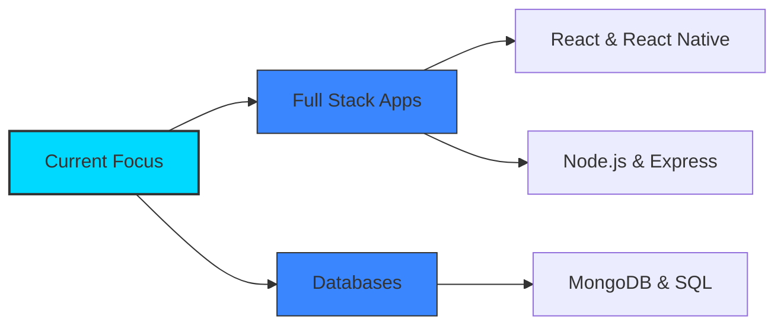

# Chiranth Janardhan Moger

<p align="left">
  <a href="https://git.io/typing-svg">
    
  </a>
</p>

---

### About Me

```javascript
const chiranth = {
    role: "Full Stack Developer",
    passion: ["Web Development", "Problem Solving", "Innovation"],
    currentFocus: "Building scalable web & mobile applications",
    lifeGoal: "Create impactful solutions for real-world problems",
    funFact: "I debug with console.log and I'm proud of it!"
};
```

---

### Tech Arsenal

<p align="left">
  <a href="https://skillicons.dev">
    
  </a>
</p>

---

### GitHub Insights

<p align="center">
  
  
</p>

<p align="center">
  
</p>

<p align="center">
  
</p>

---

### Current Focus


```mermaid
graph LR
    A[Current Focus] --> B[Full Stack Apps]
    A --> C[Databases]
    B --> D[React & React Native]
    B --> E[Node.js & Express]
    C --> F[MongoDB & SQL]
    
    style A fill:#00d9ff,stroke:#333,stroke-width:2px
    style B fill:#3a86ff,stroke:#333,stroke-width:1px
    style C fill:#3a86ff,stroke:#333,stroke-width:1px
```

---

### Let's Connect

<p align="left">
  <a href="mailto:Chiranthmoger7@gmail.com">
    
  </a>
  <a href="https://www.linkedin.com/in/chiranthmoger-01a867316">
    
  </a>
  <a href="https://github.com/Chiranth-Janardhan-moger">
    
  </a>
</p>

---

### Contribution Journey

<p align="center">
  
</p>

---

<p align="center">
  
</p>
